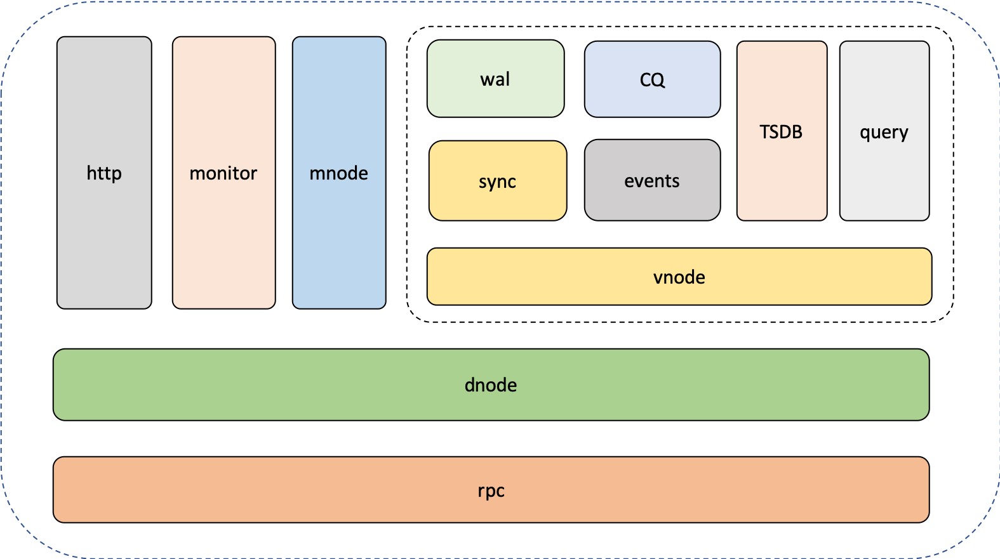
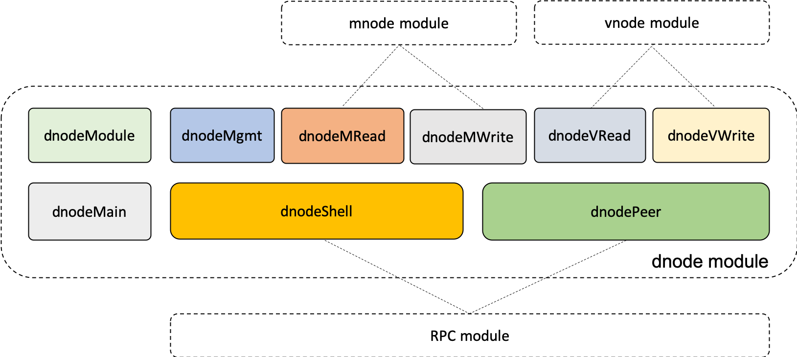
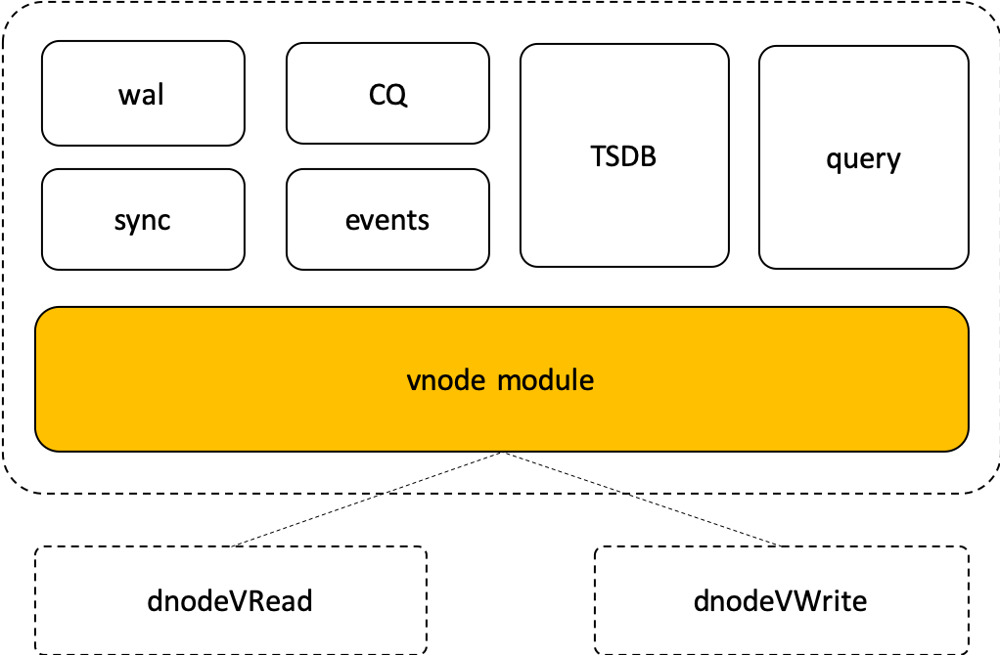

逻辑上，TDengine 系统包含 dnode，taosc 和 App，dnode 是服务器侧执行代码 taosd 的一个运行实例，因此 taosd 是 TDengine 的核心，本文对 taosd 的设计做一简单的介绍，模块内的实现细节请见其他文档。

## 系统模块图

taosd 包含 rpc，dnode，vnode，tsdb，query，cq，sync，wal，mnode，http，monitor 等模块，具体如下图：

taosd 的启动入口是 dnode 模块，dnode 然后启动其他模块，包括可选配置的 http，monitor 模块。taosc 或 dnode 之间交互的消息都是通过 rpc 模块进行，dnode 模块根据接收到的消息类型，将消息分发到 vnode 或 mnode 的消息队列，或由 dnode 模块自己消费。dnode 的工作线程（worker）消费消息队列里的消息，交给 mnode 或 vnode 进行处理。下面对各个模块做简要说明。

## RPC 模块

该模块负责 taosd 与 taosc，以及其他数据节点之间的通讯。TDengine 没有采取标准的 HTTP 或 gRPC 等第三方工具，而是实现了自己的通讯模块 RPC。

考虑到物联网场景下，数据写入的包一般不大，因此除支持 TCP 连接之外，RPC 还支持 UDP 连接。当数据包小于 15K 时，RPC 将采用 UDP 方式进行连接，否则将采用 TCP 连接。对于查询类的消息，RPC 不管包的大小，总是采取 TCP 连接。对于 UDP 连接，RPC 实现了自己的超时、重传、顺序检查等机制，以保证数据可靠传输。

RPC 模块还提供数据压缩功能，如果数据包的字节数超过系统配置参数 compressMsgSize，RPC 在传输中将自动压缩数据，以节省带宽。

为保证数据的安全和数据的 integrity，RPC 模块采用 MD5 做数字签名，对数据的真实性和完整性进行认证。

## DNODE 模块

该模块是整个 taosd 的入口，它具体负责如下任务：

- 系统的初始化，包括
  - 从文件 taos.cfg 读取系统配置参数，从文件 dnodeCfg.json 读取数据节点的配置参数；
  - 启动 RPC 模块，并建立起与 taosc 通讯的 server 连接，与其他数据节点通讯的 server 连接；
  - 启动并初始化 dnode 的内部管理，该模块将扫描该数据节点已有的 vnode ，并打开它们；
  - 初始化可配置的模块，如 mnode，http，monitor 等。
- 数据节点的管理，包括
  - 定时的向 mnode 发送 status 消息，报告自己的状态；
  - 根据 mnode 的指示，创建、改变、删除 vnode；
  - 根据 mnode 的指示，修改自己的配置参数；
- 消息的分发、消费，包括
  - 为每一个 vnode 和 mnode 的创建并维护一个读队列、一个写队列；
  - 将从 taosc 或其他数据节点来的消息，根据消息类型，将其直接分发到不同的消息队列，或由自己的管理模块直接消费；
  - 维护一个读的线程池，消费读队列的消息，交给 vnode 或 mnode 处理。为支持高并发，一个读线程（worker）可以消费多个队列的消息，一个读队列可以由多个 worker 消费；
  - 维护一个写的线程池，消费写队列的消息，交给 vnode 或 mnode 处理。为保证写操作的序列化，一个写队列只能由一个写线程负责，但一个写线程可以负责多个写队列。

taosd 的消息消费由 dnode 通过读写线程池进行控制，是系统的中枢。该模块内的结构体图如下：

## VNODE 模块

vnode 是一独立的数据存储查询逻辑单元，但因为一个 vnode 只能容许一个 DB ，因此 vnode 内部没有 account，DB，user 等概念。为实现更好的模块化、封装以及未来的扩展，它有很多子模块，包括负责存储的 TSDB，负责查询的 query，负责数据复制的 sync，负责数据库日志的的 WAL，负责连续查询的 cq（continuous query），负责事件触发的流计算的 event 等模块，这些子模块只与 vnode 模块发生关系，与其他模块没有任何调用关系。模块图如下：

vnode 模块向下，与 dnodeVRead，dnodeVWrite 发生互动，向上，与子模块发生互动。它主要的功能有：

- 协调各个子模块的互动。各个子模块之间都不直接调用，都需要通过 vnode 模块进行；
- 对于来自 taosc 或 mnode 的写操作，vnode 模块将其分解为写日志（WAL），转发（sync），本地存储（TSDB）子模块的操作；
- 对于查询操作，分发到 query 模块进行。

一个数据节点里有多个 vnode，因此 vnode 模块是有多个运行实例的。每个运行实例是完全独立的。

vnode 与其子模块是通过 API 直接调用，而不是通过消息队列传递。而且各个子模块只与 vnode 模块有交互，不与 dnode，rpc 等模块发生任何直接关联。

## MNODE 模块

mnode 是整个系统的大脑，负责整个系统的资源调度，负责 meta data 的管理与存储。

一个运行的系统里，只有一个 mnode，但它有多个副本（由系统配置参数 numOfMnodes 控制）。这些副本分布在不同的 dnode 里，目的是保证系统的高可靠运行。副本之间的数据复制是采用同步而非异步的方式，以确保数据的一致性，确保数据不会丢失。这些副本会自动选举一个 Master，其他副本是 slave。所有数据更新类的操作，都只能在 master 上进行，而查询类的可以在 slave 节点上进行。代码实现上，同步模块与 vnode 共享，但 mnode 被分配一个特殊的 vgroup ID: 1，而且 quorum 大于 1。整个集群系统是由多个 dnode 组成的，运行的 mnode 的副本数不可能超过 dnode 的个数，但不会超过配置的副本数。如果某个 mnode 副本宕机一段时间，只要超过半数的 mnode 副本仍在运行，运行的 mnode 会自动根据整个系统的资源情况，在其他 dnode 里再启动一个 mnode，以保证运行的副本数。

各个 dnode 通过信息交换，保存有 mnode 各个副本的 End Point 列表，并向其中的 master 节点定时（间隔由系统配置参数 statusInterval 控制）发送 status 消息，消息体里包含该 dnode 的 CPU、内存、剩余存储空间、vnode 个数，以及各个 vnode 的状态（存储空间、原始数据大小、记录条数、角色等）。这样 mnode 就了解整个系统的资源情况，如果用户创建新的表，就可以决定需要在哪个 dnode 创建；如果增加或删除 dnode，或者监测到某 dnode 数据过热、或离线太长，就可以决定需要挪动那些 vnode，以实现负载均衡。

mnode 里还负责 account，user，DB，stable，table，vgroup，dnode 的创建、删除与更新。mnode 不仅把这些 entity 的 meta data 保存在内存，还做持久化存储。但为节省内存，各个表的标签值不保存在 mnode（保存在 vnode），而且子表不维护自己的 schema，而是与 stable 共享。为减小 mnode 的查询压力，taosc 会缓存 table、stable 的 schema。对于查询类的操作，各个 slave mnode 也可以提供，以减轻 master 压力。

## TSDB 模块

TSDB 模块是 vnode 中的负责快速高并发地存储和读取属于该 vnode 的表的元数据及采集的时序数据的引擎。除此之外，TSDB 还提供了表结构的修改、表标签值的修改等功能。TSDB 提供 API 供 vnode 和 query 等模块调用。TSDB 中存储了两类数据，1：元数据信息；2：时序数据

### 元数据信息

TSDB 中存储的元数据包含属于其所在的 vnode 中表的类型，schema 的定义等。对于超级表和超级表下的子表而言，又包含了 tag 的 schema 定义以及子表的 tag 值等。对于元数据信息而言，TSDB 就相当于一个全内存的 KV 型数据库，属于该 vnode 的表对象全部在内存中，方便快速查询表的信息。除此之外，TSDB 还对其中的子表，按照 tag 的第一列取值做了全内存的索引，大大加快了对于标签的过滤查询。TSDB 中的元数据的最新状态在落盘时，会以追加（append-only）的形式，写入到 meta 文件中。meta 文件只进行追加操作，即便是元数据的删除，也会以一条记录的形式写入到文件末尾。TSDB 也提供了对于元数据的修改操作，如表 schema 的修改，tag schema 的修改以及 tag 值的修改等。

### 时序数据

每个 TSDB 在创建时，都会事先分配一定量的内存缓冲区，且内存缓冲区的大小可配可修改。表采集的时序数据，在写入 TSDB 时，首先以追加的方式写入到分配的内存缓冲区中，同时建立基于时间戳的内存索引，方便快速查询。当内存缓冲区的数据积累到一定的程度时（达到内存缓冲区总大小的 1/3），则会触发落盘操作，将缓冲区中的数据持久化到硬盘文件上。时序数据在内存缓冲区中是以行（row）的形式存储的。

而时序数据在写入到 TSDB 的数据文件时，是以列（column）的形式存储的。TSDB 中的数据文件包含多个数据文件组，每个数据文件组中又包含 .head、.data 和 .last 三个文件，如（v2f1801.head、v2f1801.data、v2f1801.last）数据文件组。TSDB 中的数据文件组是按照时间跨度进行分片的，默认是 10 天一个文件组，且可通过配置文件及建库选项进行配置。分片的数据文件组又按照编号递增排列，方便快速定位某一时间段的时序数据，高效定位数据文件组。时序数据在 TSDB 的数据文件中是以块的形式进行列式存储的，每个块中只包含一张表的数据，且数据在一个块中是按照时间顺序递增排列的。在一个数据文件组中，.head 文件负责存储数据块的索引及统计信息，如每个块的位置，压缩算法，时间戳范围等。存储在 .head 文件中一张表的索引信息是按照数据块中存储的数据的时间递增排列的，方便进行折半查找等工作。.head 和 .last 文件是存储真实数据块的文件，若数据块中的数据累计到一定程度，则会写入 .data 文件中，否则，会写入 .last 文件中，等待下次落盘时合并数据写入 .data 文件中，从而大大减少文件中块的个数，避免数据的过度碎片化。

## Query 模块

该模块负责整体系统的查询处理。客户端调用该该模块进行 SQL 语法解析，并将查询或写入请求发送到 vnode ，同时负责针对超级表的查询进行二阶段的聚合操作。在 vnode 端，该模块调用 TSDB 模块读取系统中存储的数据进行查询处理。query 模块还定义了系统能够支持的全部查询函数，查询函数的实现机制与查询框架无耦合，可以在不修改查询流程的情况下动态增加查询函数。详细的设计请参见《TDengine 2.0 查询模块设计》。

## SYNC 模块

该模块实现数据的多副本复制，包括 vnode 与 mnode 的数据复制，支持异步和同步两种复制方式，以满足 meta data 与时序数据不同复制的需求。因为它为 mnode 与 vnode 共享，系统为 mnode 副本预留了一个特殊的 vgroup ID:1。因此 vnode group 的 ID 是从 2 开始的。

每个 vnode/mnode 模块实例会有一对应的 sync 模块实例，他们是一一对应的。详细设计请见[TDengine 2.0 数据复制模块设计](/tdinternal/replica/)

## WAL 模块

该模块负责将新插入的数据写入 write ahead log（WAL），为 vnode，mnode 共享。以保证服务器 crash 或其他故障，能从 WAL 中恢复数据。

每个 vnode/mnode 模块实例会有一对应的 WAL 模块实例，是完全一一对应的。WAL 的落盘操作由两个参数 walLevel，fsync 控制。看具体场景，如果要 100% 保证数据不会丢失，需要将 walLevel 配置为 2，fsync 设置为 0，每条数据插入请求，都会实时落盘后，才会给应用确认

## HTTP 模块

该模块负责处理系统对外的 RESTful 接口，可以通过配置，由 dnode 启动或停止 。（仅 2.2 及之前的版本中存在）

该模块将接收到的 RESTful 请求，做了各种合法性检查后，将其变成标准的 SQL 语句，通过 taosc 的异步接口，将请求发往整个系统中的任一 dnode 。收到处理后的结果后，再翻译成 HTTP 协议，返回给应用。

如果 HTTP 模块启动，就意味着启动了一个 taosc 的实例。任一一个 dnode 都可以启动该模块，以实现对 RESTful 请求的分布式处理。

## Monitor 模块

该模块负责检测一个 dnode 的运行状态，可以通过配置，由 dnode 启动或停止。原则上，每个 dnode 都应该启动一个 monitor 实例。

Monitor 采集 TDengine 里的关键操作，比如创建、删除、更新账号、表、库等，而且周期性的收集 CPU、内存、网络等资源的使用情况（采集周期由系统配置参数 monitorInterval 控制）。获得这些数据后，monitor 模块将采集的数据写入系统的日志库（DB 名字由系统配置参数 monitorDbName 控制）。

Monitor 模块使用 taosc 来将采集的数据写入系统，因此每个 monitor 实例，都有一个 taosc 运行实例。
